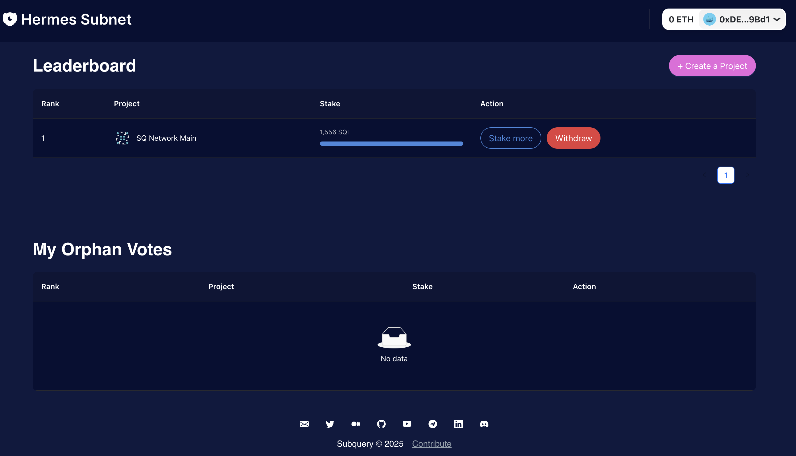
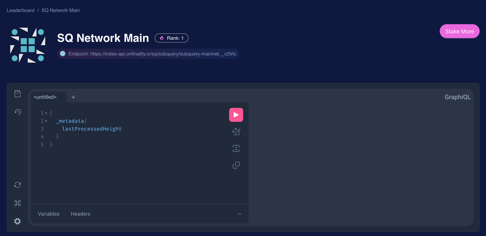
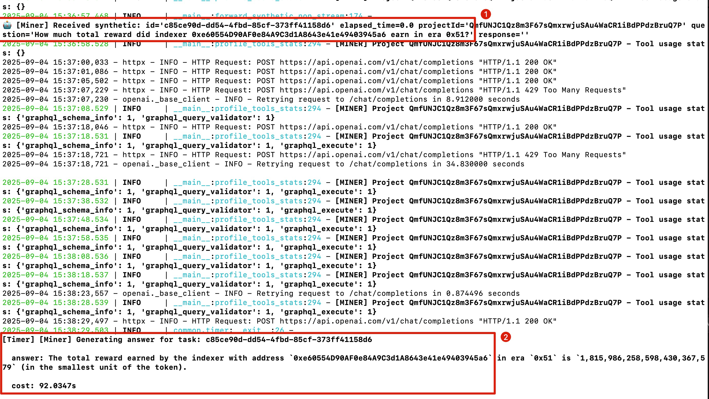

- [Miner](#miner)
- [Setup and Usage](#setup-and-usage)
  - [Prerequisites](#prerequisites)
    - [Python environment with required dependencies](#python-environment-with-required-dependencies)
    - [Bittensor wallet](#bittensor-wallet)
  - [Running a Miner](#running-a-miner)
  - [Monitoring Dashboard](#monitoring-dashboard)
  - [Mock mode](#mock-mode)
- [Optimise Miner Rewards](#optimise-miner-rewards)
  - [Scoring Mechanism Explained](#scoring-mechanism-explained)
  - [Primitive Approaches](#primitive-approaches)
  - [Step by Step Guide](#step-by-step-guide)
    - [1. Discover the project to optimise](#1-discover-the-project-to-optimise)
    - [2. Run miner](#2-run-miner)
    - [3. Wire tools](#3-wire-tools)
    - [4. Put it into production and monitor](#4-put-it-into-production-and-monitor)

**Note: This document applies to Bittensor Finney.**

If you are looking for guidance on local testing, please refer to the [local run](./local_test.md) documentation.

# Miner

Miners in our system are not traditional Bitcoin-style mining nodes. Instead, they operate at the foundational layer of the `SN SubQuery Hermes` service chain, acting as the final destination for all service requests and forming the core infrastructure of `SN SubQuery Hermes`. This role highlights the critical importance of miners within the ecosystem.

In `SN SubQuery Hermes`, miners are rewarded based on their performance in responding to synthetic challenges. To maximize profitability, miners are expected to engage in **continuously optimizing** response speed while keeping high factual accuracy.

If you are familiar to bittensor subnet set up already, skip to [Optimize Miner Rewards](#optimise-miner-rewards).

# Setup and Usage

## Prerequisites

- Python environment with required dependencies
- Bittensor wallet (coldkey and hotkey)
- Public IP for running validator
- OpenRouter or OpenAI API key for LLM access

## Minimum Hardware Requirements
- CPU: 4+ cores
- RAM: 16GB+

### Python environment with required dependencies

1、It is recommended to use `uv` with `python 3.13`

```bash
curl -LsSf https://astral.sh/uv/install.sh | sh

uv python install 3.13
```

2、clone `SN SubQuery Hermes`

```bash
git clone git@github.com:subquery/network-hermes-subnet.git

cd network-hermes-subnet

# sync and create venv
uv sync

source .venv/bin/activate

# install btcli
(network-hermes-subnet) uv pip install bittensor-cli 
```

### Bittensor wallet

We use `btcli` to create wallet.

1、Create a wallet

```bash
# this will need you to input your own password to proceed
(network-hermes-subnet) % 
btcli wallet new_coldkey --wallet.name miner
```

**Note:** This will generate a `coldkey` file in `~/.bittensor/wallets/validator`. Losing or exposing this file may compromise your funds. Keep it secure and private.

2、Create a hotkey

```bash
(network-hermes-subnet) % 
btcli wallet new_hotkey --wallet.name miner --wallet.hotkey default
```

3、Register in `SN SubQuery Hermes`

```bash
(network-hermes-subnet) % 
btcli subnet register --wallet.name miner --wallet.hotkey default
```

If the registration is successful, you will receive a **UID**, which represents your hotkey slot in `SN SubQuery Hermes`.

**Note:** This operation requires a burn fee. Make sure your cold wallet has a sufficient TAO balance.

## Running a Miner

With everything prepared, it’s time to launch the miner.

First, create a configuration file.

```bash
(network-hermes-subnet) %
cp .env.miner.example .env.miner
```

Second, edit the file to apply your own settings:

```ini
SUBTENSOR_NETWORK=your_subtensor_ws_rpc
WALLET_NAME=validator
HOTKEY=default

# Your public IP address and port
EXTERNAL_IP=your_public_ip
EXTERNAL_PORT=your_public_port

# Internal bind address/port (inside VM/container)
BIND_IP=0.0.0.0
BIND_PORT=8086

OPENAI_API_BASE=https://openrouter.ai/api/v1
OPENAI_API_KEY=sk-xxx

# For GraphQL agent & synthetic challenges
LLM_MODEL=google/gemini-3-flash-preview

# Miner self-owned agent
MINER_LLM_MODEL=google/gemini-3-flash-preview

# The Graph API token for querying subgraph data, needed for TheGraph projects
# free api token can be obtained from https://thegraph.com/docs/en/subgraphs/querying/managing-api-keys/
THEGRAPH_API_TOKEN=xx

# The Codex API key for querying Codex data. needed for Codex projects
# free api key can be obtained from https://dashboard.codex.io/dashboard/api-keys
CODEX_API_TOKEN=xx

# Enable only when you use a custom optimised LLM
ENABLE_FALL_BACK_GRAPHQL_AGENT=false
```

Configuration Parameters:

* `WALLET_NAME`: The identifier of your previously created cold wallet.
* `HOTKEY`: The identifier of your previously created hotkey wallet.
* `EXTERNAL_IP`: Your public IP address,  it serves as the entry point for other neurons to communicate with.
* `EXTERNAL_PORT`: Public port corresponding to your `EXTERNAL_IP` (the port advertised on-chain).
* `BIND_IP`: Local bind address for the miner service. Use `0.0.0.0` in most deployments.
* `BIND_PORT`: Local port your miner process listens on (inside VM/container).
* `SUBTENSOR_NETWORK`: WebSocket RPC endpoint of the Bittensor network you are connecting to.
* `OPENAI_API_BASE`: (Optional) Base URL for the LLM API endpoint. Defaults to OpenAI's API if not specified.
* `OPENAI_API_KEY`: API key for OpenAI (currently the only supported provider).
* `LLM_MODEL`: LLM model used by the `Subql GraphQL Agent`. This model serves as a fallback when the miner agent cannot handle a query, ensuring that synthetic challenges and GraphQL-based requests are processed..
* `MINER_LLM_MODEL`: LLM model used by the miner to analyze projects and serve query requests. Generally, the more powerful the model, the higher its factual accuracy.
* `ENABLE_FALL_BACK_GRAPHQL_AGENT`: When none of the tools are matched, the request will be redirected to the `Subql GraphQL Agent`. Default is `False`.

Last,  launch the miner：

```bash
(network-hermes-subnet) % 
python -m neurons.miner
```

This will pull projects and start serving. You should see output similar to the following:

```bash
2025-09-04 13:42:03.416 | INFO     | agent.agent_zoo:load_agents:100 - [AGENT] Creating agent for project QmfUNJC1Qz8m3F67sQmxrwjuSAu4WaCR1iBdPPdzBruQ7P using model gpt-4o-mini
2025-09-04 13:42:06.102 | INFO     | __main__:profile_tools_stats:293 - [MINER] Project QmfUNJC1Qz8m3F67sQmxrwjuSAu4WaCR1iBdPPdzBruQ7P - Tool usage stats: {}
2025-09-04 13:42:06.105 | INFO     | neurons.miner:start:101 - Stats at: http://1.37.27.39:8086/stats
```

## Monitoring Dashboard

Once your miner is running, you can access a built-in monitoring dashboard to track its performance:

**Access URL**: `http://<EXTERNAL_IP>:<EXTERNAL_PORT>/stats`

For example, if your external IP is `1.37.27.39` and external port is `8086`, visit:
```
http://1.37.27.39:8086/stats
```

### Dashboard Features

The monitoring dashboard provides real-time insights into:

- **Request Statistics**: Total number of requests processed
- **Response Times**: Average and current response times
- **Success Rates**: Percentage of successful vs failed requests
- **Project Usage**: Usage statistics per project
- **Tool Usage**: Which tools are being called and how frequently
- **Error Rates**: Types and frequency of errors
- **Performance Metrics**: CPU usage, memory consumption, and other system metrics

### Monitoring Best Practices

1. **Regular Checks**: Monitor the dashboard regularly to ensure your miner is performing optimally
2. **Tool Optimization**: Use tool usage statistics to identify which custom tools are most effective
3. **Performance Tuning**: Monitor response times and optimize slow-performing tools
4. **Error Tracking**: Keep an eye on error rates to identify and fix issues quickly
5. **Resource Management**: Monitor system resources to prevent overloading

### Troubleshooting

If you cannot access the dashboard:

1. **Check Firewall**: Ensure port 8086 (or your configured port) is open in your firewall
2. **Verify IP**: Confirm your `EXTERNAL_IP` in the configuration file is correct
3. **Check Port**: Make sure the port is not already in use by another service
4. **Network Access**: Test connectivity from your browser to the miner's IP and port

The dashboard updates in real-time and provides essential information for optimizing your miner's performance and maximizing rewards.

## Mock mode

Mock mode allows miners to debug production environment project challenges locally. Challenges are sourced from the board: https://board.hermes-subnet.ai/board-stats

In mock mode, miners do not interact with the blockchain.

### Steps to enable mock mode:

**1. Configure .env.miner**

Set up your `.env.miner` file as you would for production (IP/port/wallet/models, etc.)

**2. Enable mock mode in .env.miner**

Uncomment and configure the following lines:

```ini
# Local debugging mode (doesn't interact with chain)
RUNNING_MODE=mock

# LLM model for scoring in mock mode (compares ground truth with miner answers)
SCORE_LLM_MODEL=google/gemini-3-flash-preview
```

**3. Start the miner**

Run the miner and verify the following output:

```bash
$ python -m neurons.miner

2026-03-09 15:44:58.174 | INFO     | common.mock_config:write:68 - [MockConfig] Configuration written to shared memory 'mock_validator_config' (169 bytes)
2026-03-09 15:44:58.174 | INFO     | __main__:start:152 - [Miner] ✅ Mock configuration written to shared memory
```

**4. Start the mock validator process**

In a separate terminal, run:

```bash
$ python -m scripts.mock_validator
```

Once started successfully, the validator will send challenges to the miner in the order they appear on the board, and simulate the real validator behavior by scoring the responses.


# Optimise Miner Rewards

## Scoring Mechanism Explained
1. Validators pick the selected project(s) from the board (https://board.hermes-subnet.ai)
2. Each of those projects has a subquery endpoint or a subgraph endpoint attached to it.
3. Validators generate a synthetic challenge based on the project's schema and send it to miners. At the same time, validators send the challenge to the graphql agent for ground truth.
4. Validators evaluate the miner's response based on its factual accuracy and response time.

## Primitive Approaches 
Miners are expected to optimise the response time to the synthetic challenges while maintaining high factual accuracy.
There are two ways to do such and earn more rewards than competing miners:
* Wiring hand-crafted tools to the project, which generates same or optimised graphql queries, triming the data to bring down the response time.
* Improving the graphql agent itself to be more efficient.
* Use a better LLM model which is more efficient but has the same level of intelligence, so the result it gives is as accurate as the ground truth.

## Step by Step Guide
### 1. Discover the project to optimise

Go to the [board](https://board.hermes-subnet.ai) and find the selected project for miners to work on.



Click to understand the project's schema and data, find the graphql endpoint and test queries in the playground.



### 2. Run miner
```
uv run python -m neurons.miner
```
it should load current active projects and create folders for each project in `projects/miner`.

The directory structure looks like this:

```bash
...
── neurons
│   ├── miner.py
│   └── validator.py
├── projects
│   ├── miner
│   │   └── QmfUNJC1Qz8m3F67sQmxrwjuSAu4WaCR1iBdPPdzBruQ7P
│   │       └── config.json
│   │       └── tools.py
│   │   └── <project_id>
│   │       └── config.json
│   │       └── tools.py
├── pyproject.toml
└── uv.lock
```

and miner can see what kind of challenges it is receiving:



### 3. Wire tools
Create a `tools.py` file in the project folder. The tools should be exported in the following format:
```python
tools = [ tool_1, tool_2 ]
```

For starter, can copy `projects/miner/QmfUNJC1Qz8m3F67sQmxrwjuSAu4WaCR1iBdPPdzBruQ7P/tools.py` to other projects.

To create your own tool, note that we use langgraph (https://github.com/langchain-ai/langgraph) to build the agent,
it reads the tool's description and arguments from function docstring. So make sure you change them after the copy, and write clear and complete docstring for your tool.

**Important Notes on Tool Implementation:**

There are different requirements depending on the project type:

**For Codex Projects:**
- Due to the unique nature of Codex projects, tools do NOT require a `block_height` parameter
- Instead, each tool must return **two parts**:
  1. **Result**: The answer or data returned by the tool
  2. **Query**: The GraphQL query used to retrieve the data
- Both parts will be used by validators for scoring
- **Example**: See the sample tools in the `projects/miner/codex_de839e3d` directory for reference

**For Other Projects (Non-Codex):**
- To ensure the spatio-temporal uniqueness of challenges, each challenge automatically includes a `block_height` parameter
- Therefore, every tool **must** include a `block_height` parameter
- **Example**: Refer to the sample tools in the `projects/miner/QmfUNJC1Qz8m3F67sQmxrwjuSAu4WaCR1iBdPPdzBruQ7P_00021a18` directory for reference


### 4. Put it into production and monitor
Restart miner.

Monitor the tool usage stats from console logs to see if the tool is being used. and to see if the response time is improved.
We will release more tools for miners to compare their result with graphql agent results.

We can see that the query invoked our added tool **query_indexer_rewards**, as indicated by the increment in the tool stats logs.

```bash
[MINER] Project QmfUNJC1Qz8m3F67sQmxrwjuSAu4WaCR1iBdPPdzBruQ7P - 
Tool usage stats: {'query_indexer_rewards': 1}
```

If the tool is not being used, you can try to improve the tool's description and arguments, or the prompt to make the tool more likely to be called.

Or it could because the challenge is not related to the tool. Miner should always add more tools to increase the hit rate.
